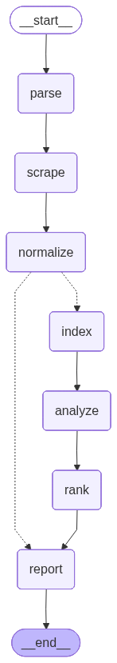
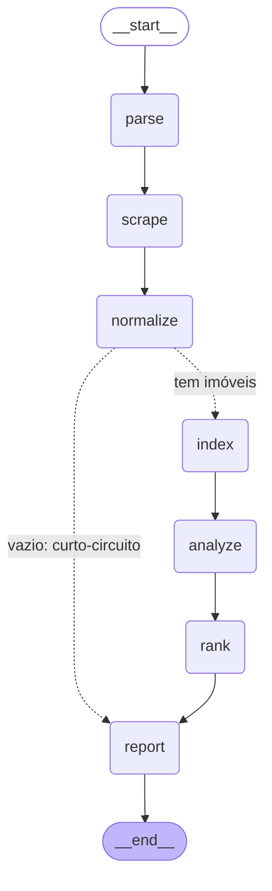
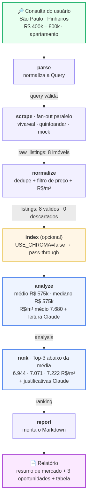
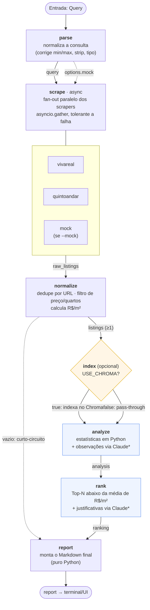

# Máquina de estado do agente Deep-Research

O agente é um **grafo de estado** do LangGraph. Cada nó lê/escreve um estado
compartilhado (`GraphState`) e passa o controle ao próximo. Os diagramas abaixo
estão em [Mermaid](https://mermaid.js.org/) — renderizam automaticamente no
GitHub/GitLab e em editores Markdown.

> Reproduza o diagrama oficial a qualquer momento:
> ```bash
> PYTHONPATH=src python -c "from deep_research.graph import build_graph; print(build_graph().get_graph().draw_mermaid())"
> ```

---

## A. Diagrama oficial (exportado do grafo compilado)

Topologia exata, gerada pelo próprio LangGraph — é fiel ao que roda.



O mesmo grafo em Mermaid (editável):



Há **uma ramificação condicional** na topologia: após `normalize`, se não houver
imóveis, o grafo faz **curto-circuito** direto para `report` (pulando
`index`/`analyze`/`rank`). As demais "decisões" (pular Chroma, degradar o LLM,
ignorar portal que falhou) acontecem **dentro** dos nós.

---

## A.1. Exemplo de execução (pipeline anotado)

Mesma topologia com um **exemplo de consulta real** percorrendo o grafo
(São Paulo · Pinheiros · R$ 400k–800k · apartamento — execução validada em
`--mock`). Cada aresta mostra o dado que trafega; as cores indicam o tipo de nó.



> Ambas as imagens são geradas por `scripts/diagrams.py`:
> ```bash
> PYTHONPATH=src python scripts/diagrams.py
> ```

---

## B. Diagrama anotado (comportamento real)

Mesma topologia, mas explicitando o que cada nó faz com o estado, os pontos
opcionais/condicionais e os dados que trafegam em cada transição.



`*` Nós marcados em azul usam o **Claude** apenas para texto qualitativo. Sem
`ANTHROPIC_API_KEY`, eles **degradam** para um placeholder/justificativa
calculada — o pipeline continua rodando.

---

## C. O estado que percorre o grafo (`GraphState`)

Cada nó recebe o estado e devolve um **dicionário parcial** que o LangGraph
mescla. A tabela mostra o que é lido/escrito em cada transição:

| Nó | Lê | Escreve |
|----|----|---------|
| `parse`     | `query`, `options`        | `query` (normalizada) |
| `scrape`    | `query`, `options`        | `raw_listings` |
| `normalize` | `query`, `raw_listings`   | `listings` |
| `index`     | `listings`                | — (efeito colateral no Chroma) |
| `analyze`   | `query`, `listings`       | `analysis` |
| `rank`      | `query`, `listings`, `analysis` | `ranking` |
| `report`    | `query`, `listings`, `analysis`, `ranking` | `report` |

---

## D. Pontos de decisão (dentro dos nós, não na topologia)

| Decisão | Onde | Efeito |
|---------|------|--------|
| Usar dados sintéticos | `scrape` lê `options.mock` | roda só o `MockScraper` |
| Portal falhou | `scrape` (`return_exceptions`) | loga e ignora, segue com os demais |
| Indexar no Chroma | `index` lê `USE_CHROMA` | indexa ou faz pass-through |
| LLM indisponível | `analyze`/`rank` checam a API key | usa placeholder / justificativa calculada |
| Resultado vazio | aresta condicional após `normalize` | **curto-circuito**: pula `index`/`analyze`/`rank`, vai direto ao `report` ("Nenhum imóvel encontrado") |

---

## E. Gerar imagem (PNG)

Mermaid já renderiza no GitHub. Para um PNG (ex.: slide do pitch):

```bash
# via API mermaid.ink (precisa de internet)
PYTHONPATH=src python -c "from deep_research.graph import build_graph; open('grafo.png','wb').write(build_graph().get_graph().draw_mermaid_png())"
```

Ou cole o bloco Mermaid em <https://mermaid.live> e exporte como PNG/SVG.
